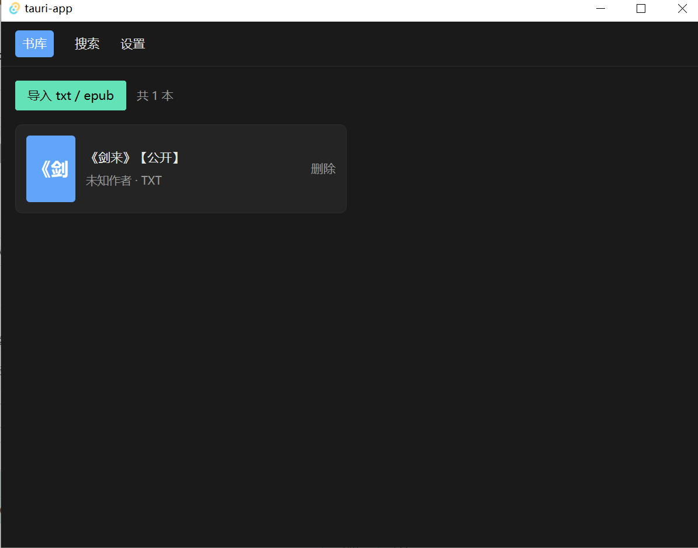
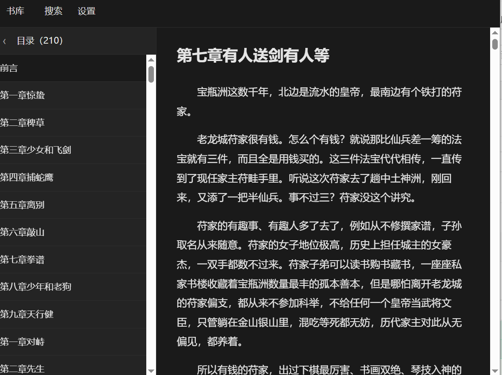

<!--
 * @Author: YangHeng66 yangheng66@gmail.com
 * @Date: 2026-04-21 14:17:23
 * @LastEditors: YangHeng66 yangheng66@gmail.com
 * @LastEditTime: 2026-04-21 15:28:44
 * @FilePath: \txtRead\README.md
 * @Description: 这是默认设置,请设置`customMade`, 打开koroFileHeader查看配置 进行设置: https://github.com/OBKoro1/koro1FileHeader/wiki/%E9%85%8D%E7%BD%AE
-->

# 小说阅读器

基于 Tauri 2 的桌面小说阅读器，支持 `.txt`（自动识别编码与拆分章节）和 `.epub`（原生目录解析）。



## 开发

```bash
pnpm install
pnpm tauri dev
```

## 构建

```bash
pnpm tauri build
```

构建产物位于 `src-tauri/target/release/bundle/`。

## 功能特性

- **书库**：支持导入、查看和删除 `.txt` / `.epub`
- **阅读器**：支持目录导航、自动保存阅读进度（书籍 + 章节 + 滚动位置）、字体大小调节、明暗主题切换
- **搜索**：基于 FTS5 的全库全文检索，点击结果即可跳转

## 架构说明

- 后端（Rust / Tauri 2）：负责文件 I/O、SQLite + FTS5 持久化、txt 编码检测（chardetng）、章节正则切分、epub 解析。所有命令均通过 `#[tauri::command]` 暴露。
- 前端（Vue 3 + TypeScript / Pinia / Naive UI / vue-router）：包含书库、阅读器、搜索三个视图，不承载业务逻辑，仅封装 `invoke` 调用。

## 测试

```bash
cd src-tauri && cargo test
```

共 14 个单元测试，覆盖编码检测、章节切分（中文 / 英文 / 序章）、epub 解析，以及全部数据库模块（books / chapters / progress / settings / FTS5 search）。
